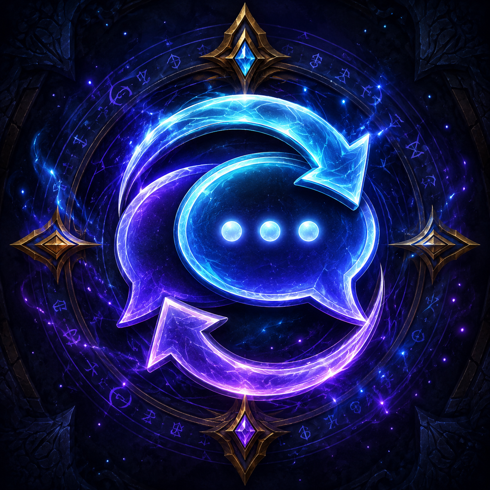

  

<h1 align="center">Chat Sync</h1>

  <b>Set up your chat once. Get it on every character.</b> 
  Account-wide chat-window profiles for <b>WoW Classic Era / Hardcore (1.15.x)</b>.

---

WoW saves your chat windows **per character**, so every new alt starts with the
default layout. Chat Sync snapshots a character's setup — tabs, channels, message
types, names, colors, transparency, font size, sizes and positions — into an
**account-wide profile** you can drop onto any other character.

## Features

- **Profiles shared across the whole account.**
- **New-character prompt** — a fresh character can pop a little window to pick a
  profile (or auto-apply your default, or do nothing — your choice).
- **Auto-update** — the character a profile was saved from keeps it current: change
  a chat window and it re-saves into that profile (and on logout). There's also a
  one-click **Save changes** button.
- **Separated/floating windows** keep their own position and size.
- **Minimap button** + a settings page. No tainting of the Group Finder.

## Usage

Open the settings with **`/chatsync`**, **`/csync`**, or **`/cs`** — or left-click
the minimap button (right-click pops the profile chooser).

| Command | What it does |
|---|---|
| `/cs save <name>` | Save the current character's chat layout as a profile |
| `/cs apply <name>` | Apply a profile to the current character |
| `/cs default <name>` | Set which profile new characters are offered |
| `/cs list` | List saved profiles |
| `/cs delete <name>` | Delete a profile |
| `/cs welcome` | Preview the new-character chooser |

**Typical flow:** on the character whose chat you like, `/cs save Main`. Make a new
character → it offers to apply "Main". On an existing alt, apply it from the settings
page or `/cs apply Main`.

## Notes

- Custom/numbered channels (a "world" or "LFG" channel) are re-joined by name, but
  channel order/numbering can differ per character — a WoW limitation, not a bug.
- Profiles are stored account-wide; existing characters are never changed
  automatically — only brand-new ones (and only if you let them).

## Install

Drop the `ChatSync` folder into `Interface/AddOns`, or install from CurseForge.

---

<i>Made by vebjorn.</i>

